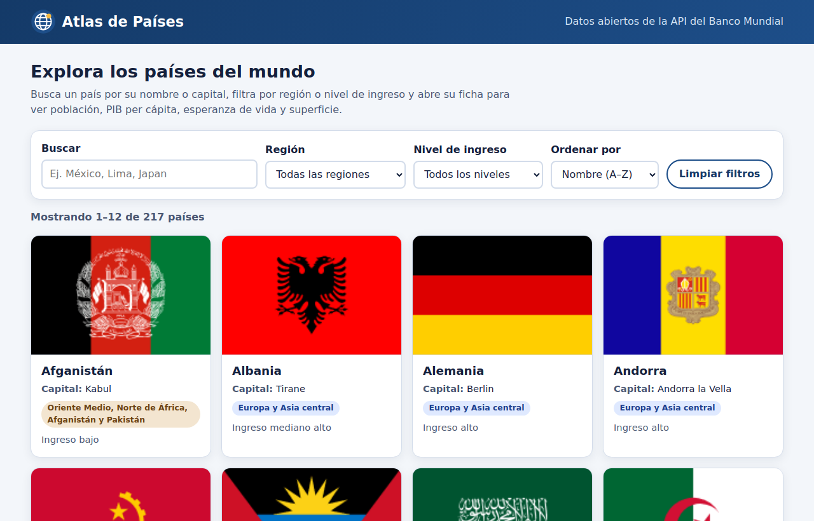
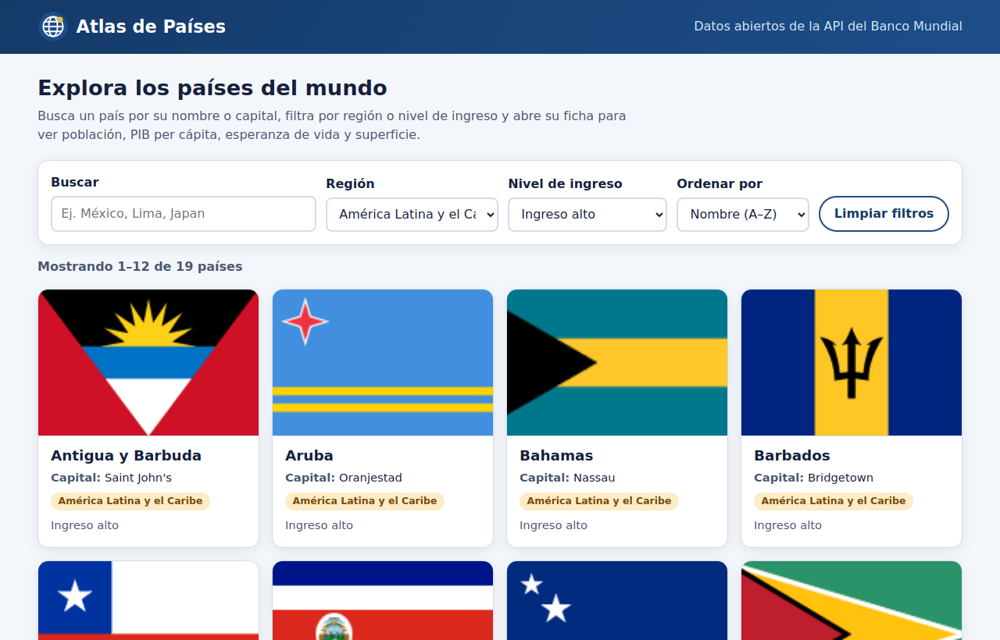
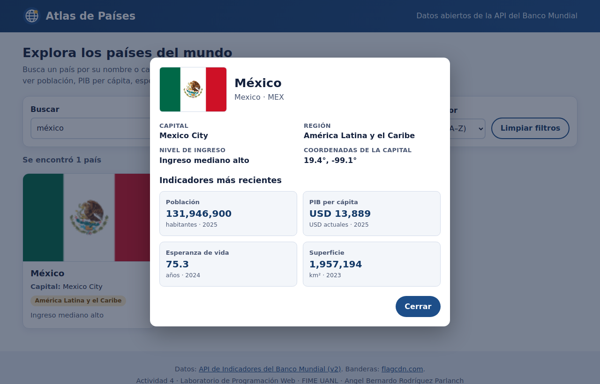
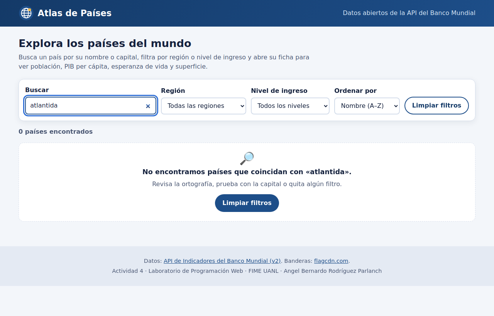
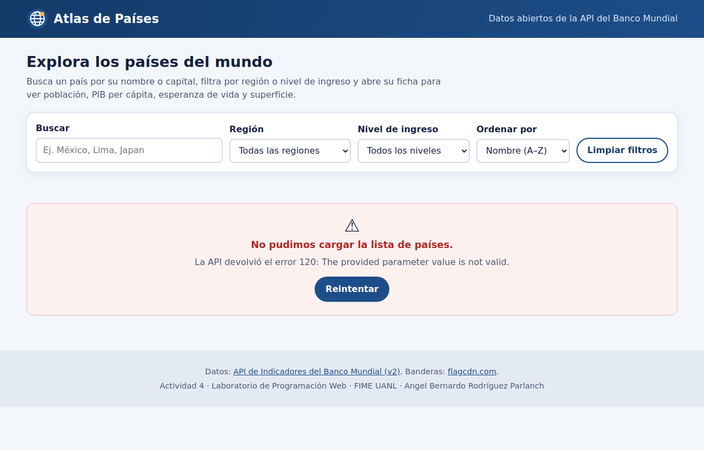
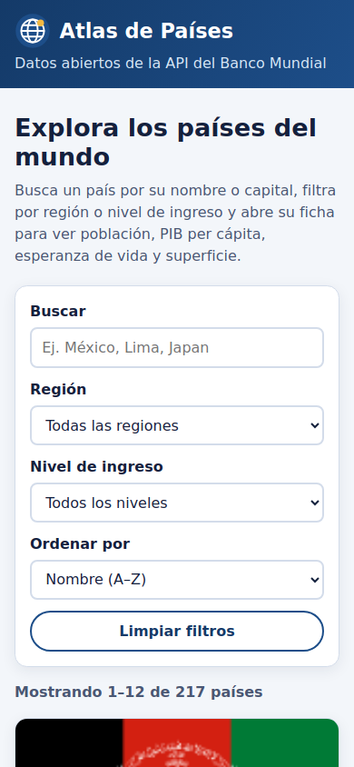

# Atlas de Países — Miniaplicación web que consume una API REST

**Laboratorio de Programación Web · Actividad 4**<br>
Facultad de Ingeniería Mecánica y Eléctrica (FIME), UANL

| | |
|---|---|
| **Alumno** | Angel Bernardo Rodríguez Parlanch |
| **Matrícula** | 1951732 |
| **Aplicación publicada** | https://id0cool.github.io/atlas-paises/ |
| **Repositorio** | https://github.com/id0cool/atlas-paises |



---

## 1. Descripción

**Atlas de Países** consulta en tiempo real la **API de Indicadores del Banco Mundial (v2)** para mostrar los 217 países y territorios que el Banco Mundial registra. Cada país aparece como una tarjeta con su bandera, nombre en español, capital, región y nivel de ingreso. Al abrir una tarjeta se hace una segunda consulta a la API para traer cuatro indicadores recientes: población, PIB per cápita, esperanza de vida y superficie.

Todo se hace del lado del cliente con `fetch` y `async/await`, sin librerías ni frameworks.

## 2. La API utilizada

| Dato | Valor |
|---|---|
| Nombre | World Bank Indicators API v2 |
| Documentación | https://datahelpdesk.worldbank.org/knowledgebase/articles/889392 |
| URL base | `https://api.worldbank.org/v2` |
| Autenticación | No requiere clave ni registro |
| Datos sensibles | Ninguno: son estadísticas públicas por país |
| CORS | Permitido, se puede llamar directamente desde el navegador |

> **¿Por qué no REST Countries?** Al revisar la documentación de REST Countries se encontró que las versiones v1 a v4 fueron dadas de baja y que la versión v5 exige una clave personal en el encabezado `Authorization`. Publicar esa clave en un sitio estático la dejaría expuesta, así que se eligió la API del Banco Mundial, que también ofrece datos de países y es abierta.

### Endpoints

| Uso en la app | Método y ruta | Parámetros |
|---|---|---|
| Lista de países | `GET /country` | `format=json`, `per_page=400` |
| Indicadores de un país | `GET /country/{ISO3}/indicator/{id1;id2;id3;id4}` | `format=json`, `source=2`, `mrnev=1`, `per_page=50` |

- `format=json` pide la respuesta en JSON (por defecto la API responde XML).
- `per_page` controla la paginación del servidor; con 400 llega la lista completa en una sola petición.
- `source=2` indica la base *World Development Indicators*, necesaria para pedir varios indicadores separados por `;`.
- `mrnev=1` (*most recent non-empty value*) devuelve solo el dato más reciente que no esté vacío.

Indicadores consultados: `SP.POP.TOTL` (población), `NY.GDP.PCAP.CD` (PIB per cápita en USD), `SP.DYN.LE00.IN` (esperanza de vida) y `AG.SRF.TOTL.K2` (superficie en km²).

### Formato de respuesta

La API responde un **arreglo de dos elementos**: primero los metadatos de paginación y después los datos.

```json
[
  { "page": 1, "pages": 1, "per_page": "400", "total": 295 },
  [
    {
      "id": "MEX", "iso2Code": "MX", "name": "Mexico",
      "region": { "id": "LCN", "value": "Latin America & Caribbean " },
      "incomeLevel": { "id": "UMC", "value": "Upper middle income" },
      "capitalCity": "Mexico City", "longitude": "-99.1276", "latitude": "19.427"
    }
  ]
]
```

De los 295 registros, 78 son agregados (regiones, grupos de ingreso). La API los marca con `region.id = "NA"` y la app los descarta.

### Errores de la API

| Caso | Qué responde la API | Cómo lo maneja la app |
|---|---|---|
| Parámetro o código inválido | HTTP 200 con `[{"message":[{"id":"120","key":"Invalid value", ...}]}]` | Se detecta el campo `message` y se muestra «La API devolvió el error 120…» |
| Indicador sin datos | HTTP 200 con `total: 0` y datos `null` | La tarjeta del indicador muestra «Sin datos» |
| Error del servidor (5xx) o límite (429) | Código HTTP de error | Se reintenta automáticamente y, si sigue fallando, se muestra el código |
| Sin conexión / CORS / caída | `fetch` lanza `TypeError` | Mensaje «No se pudo conectar con la API…» y botón **Reintentar** |
| Respuesta lenta | — | `AbortController` corta la petición a los 12 s |

## 3. Funcionalidades

| Requisito | Implementación |
|---|---|
| Consumo con `fetch` y `async/await` | `js/api.js`: función `pedir()` con `try/catch/finally`, tiempo límite y hasta 2 reintentos para fallas temporales |
| Procesar JSON y crear componentes | Los registros se normalizan (nombre en español con `Intl.DisplayNames`, región e ingreso traducidos) y las tarjetas se crean con `createElement` y `DocumentFragment` |
| Interacción | **Búsqueda** por nombre en español o inglés y por capital (ignora acentos), **filtro** por región y por nivel de ingreso, **orden** A–Z / Z–A / por capital, **paginación** de 12 en 12 y **selección** de un país para ver su ficha |
| Estado de carga | Spinner con mensaje y tarjetas «esqueleto»; en la ficha, barras animadas mientras llegan los indicadores |
| Estado vacío | Mensaje con el texto buscado y botón **Limpiar filtros** |
| Estado de error | Mensaje claro según el tipo de falla y botón **Reintentar** (lista y ficha por separado) |

Para revisar los estados de error sin desconectar el equipo:

- https://id0cool.github.io/atlas-paises/?simular=error-api → la API responde el error 120.
- https://id0cool.github.io/atlas-paises/?simular=sin-red → la petición falla como si no hubiera red.

## 4. Capturas

| Filtros (América Latina + ingreso alto) | Ficha de un país |
|---|---|
|  |  |

| Estado vacío | Estado de error | Móvil |
|---|---|---|
|  |  |  |

## 5. Cómo usarla

1. Abre https://id0cool.github.io/atlas-paises/.
2. Escribe en **Buscar** un país o una capital (por ejemplo `peru`, `Lima` o `Japan`).
3. Combina los filtros de **Región** y **Nivel de ingreso**, y elige el **orden**.
4. Usa **Anterior / Siguiente** para moverte entre páginas.
5. Haz clic en una tarjeta para abrir su ficha; ciérrala con **Cerrar**, con `Esc` o haciendo clic fuera.

Para ejecutarla en local basta un servidor estático (los módulos ES no cargan desde `file://`), por ejemplo la extensión **Live Server** de VS Code o `python -m http.server`.

## 6. Estructura del proyecto

```
atlas-paises/
├── index.html        # Estructura: controles, estados, lista, paginación y <dialog>
├── css/
│   └── styles.css    # Estilos mobile-first (Grid y Flexbox)
├── js/
│   ├── api.js        # Peticiones a la API, manejo de errores, reintentos y normalización
│   ├── ui.js         # Creación de tarjetas, estados y ficha de detalle
│   └── app.js        # Estado, búsqueda, filtros, orden, paginación y eventos
├── img/
│   ├── logo.svg
│   └── capturas/     # Imágenes de este README
├── .github/workflows/
│   └── capturas.yml  # GitHub Actions: toma las capturas del sitio publicado con Playwright
└── README.md
```

Las capturas de la sección 4 no se tomaron a mano: el flujo `capturas.yml` abre el sitio publicado con Playwright, reproduce cada caso (filtros, ficha, búsqueda sin resultados, error y vista móvil) y guarda las imágenes en el repositorio. Así muestran la aplicación real consultando la API.

## 7. Calidad

- HTML y CSS validados con el **W3C Nu Html Checker**: sin errores.
- JavaScript revisado con **ESLint** (`no-undef`, `no-unused-vars`, `prefer-const`, `eqeqeq`): sin errores.
- El texto que llega de la API se escapa antes de insertarlo con `innerHTML`.
- Accesibilidad: etiquetas en todos los campos, `aria-live` en contador y estados, tarjetas como botones navegables con teclado, `alt` en banderas y foco visible.
- Banderas: [flagcdn.com](https://flagcdn.com). Si alguna no existe, se muestra un recuadro con el código del país.

## 8. Reflexión técnica

Lo más importante de esta actividad fue entender que una petición a una API puede fallar de varias formas distintas y que cada una se detecta en un lugar diferente. Un error de red hace que `fetch` lance una excepción, un 500 llega como respuesta con `ok = false`, y la API del Banco Mundial reporta los parámetros inválidos con un **200** y un objeto `message` dentro del JSON. Si solo se revisa `response.ok`, ese último caso pasaría como si fuera un éxito, por eso la función `pedir()` valida también la forma del JSON antes de devolverlo.

Durante las pruebas algunas peticiones fallaron de forma aleatoria. Eso llevó a dos mejoras: pedir los cuatro indicadores en **una sola llamada** (separándolos con `;`) en lugar de cuatro, y agregar **reintentos** con espera creciente solo para fallas temporales. También se guardan en caché los indicadores ya consultados para no repetir peticiones al abrir de nuevo la misma ficha.

`async/await` hizo que el flujo se leyera como código secuencial: mostrar el estado de carga, esperar los datos y, según el resultado, dibujar las tarjetas o el mensaje de error. Separar el código en tres módulos (`api`, `ui`, `app`) permitió cambiar la forma de pedir los indicadores sin tocar la interfaz. Como mejora futura se podría guardar la búsqueda y los filtros en la URL para compartir una vista, o agregar gráficas con la evolución histórica de cada indicador.

---

Proyecto académico. Datos © Banco Mundial, publicados bajo licencia CC BY 4.0.
